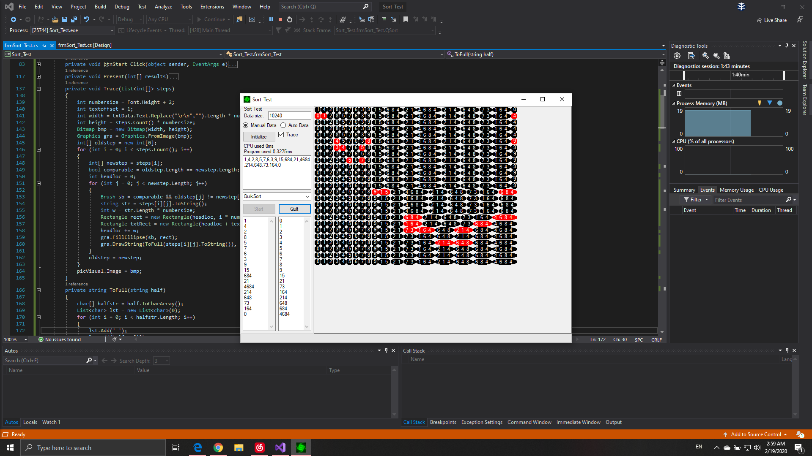

# Sort_Test

This project helps you visualize sorting algorithms and compare them!
- Compare timings！
- See how data is moved!
- Supports auto generated random data
- Supports data input by hand

***Well, if your data size is too large, you might not want to visualize it***
***since it will cause hangs or overflow exceptions.***
***Only use [Track] function to visualize the sorting if your data size is small.***

 ## UI

